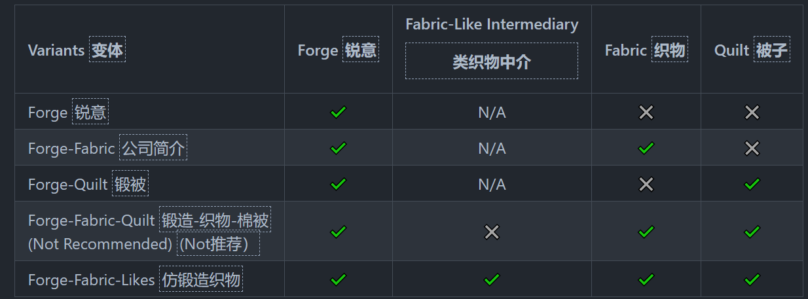
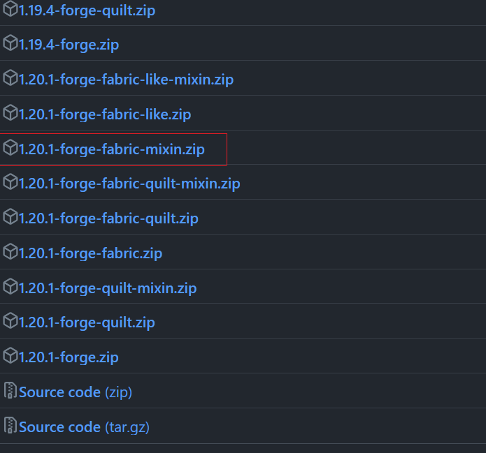
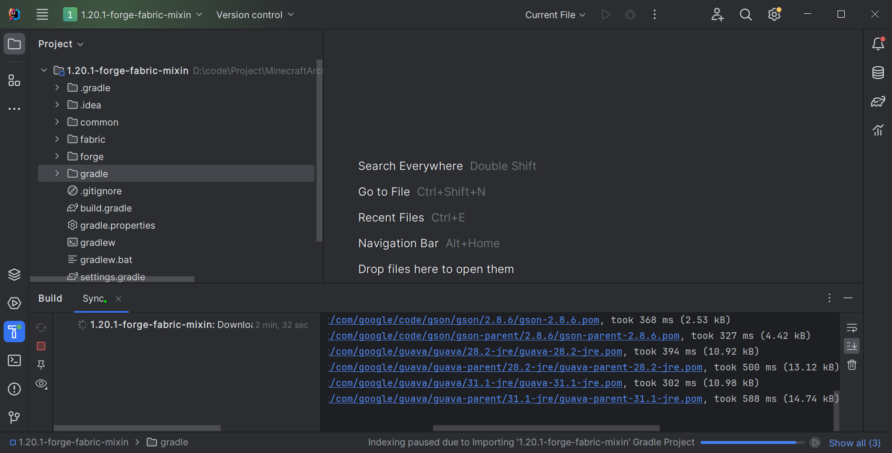
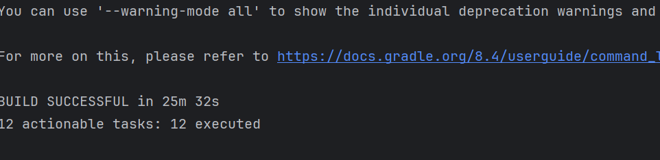

# Architectury是什么东西

Architectury是一个工具链。
目的是：为了简化开发多平台mod
什么用：可以让你开发一次，发布forge和fabric平台。

# 怎么开始

## 如何开始使用

1. 下载[架构模板](https://github.com/architectury/architectury-templates/releases/)并将其导入为Gradle项目
2. 使用模板生成器生成更新模板。

这里采用第一种方法

## 使用Architectury模板构建自己项目

### 如何选择模板

要选择模板需要搞清楚几个概念

#### 简介mixin

Mixins是一个在Forge和Fabric上都可以使用的修改系统。由于Forge一般提供了对游戏的修改方法，所以可能不需要知道Mixins，但是对于Fabric是必须的。

#### 怎么了解Mixins

[Fabric Wiki](https://fabricmc.net/wiki/tutorial:mixin_introduction)是一个很好的资源。如果你只是添加一些简单方块物品，那么不需要用到Mixins，Fabric提供了这样的功能，但是如果你添加负责的功能，这是必要的。

#### 搞清楚我是否需要Quilt

#### 当前由那些模板变体

- Forge：Forge子项目用于调用特定的Forge代码，处理ForgeInit，此子项目可以执行Forge
- Fabric-Like Intermedinary：调用Fabric API绑定类Fabric项目，可用于调用不特定的Fabric和Quilt代码，例如Fabric和Quilt都支持的钩子，此子项目不可执行。
- Fabric：Fabric子项目用于调用特定的Fabric代码，处理Fabirc Init。此子项目可执行Fabric代码
- Quilt：同上

支持的子项目

根据你需求选择不同的模板，我这里选择Forge-Fabric 需要mixin

#### 如何使用

下载解压后用idea打开文件夹即可。
它会自动构建项目，等待successful即可。

构建完成后

### 有哪些内容是我需要配置的

你需要配置的文件具有如下（如果存在的话）：

- gradle.properties
- fabric.mod.json
- META-INF/mods.toml
- quilt.mod.json
- architectury.common.json
- examplemod.accesswidener
- examplemod-common.mixins.json

并且需要配置类的定位，还需要更改common/build.gradle中的访问加宽器。

## 如果我不想使用Architectury API

## 如何将先有个的项目转化为Architectury项目
